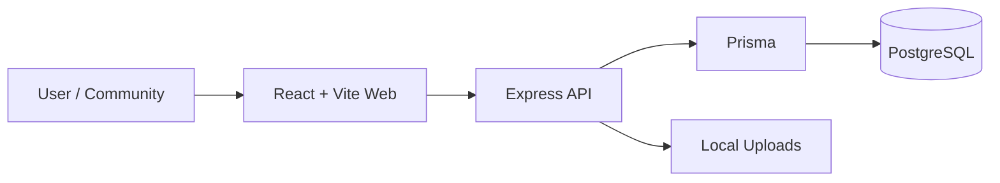
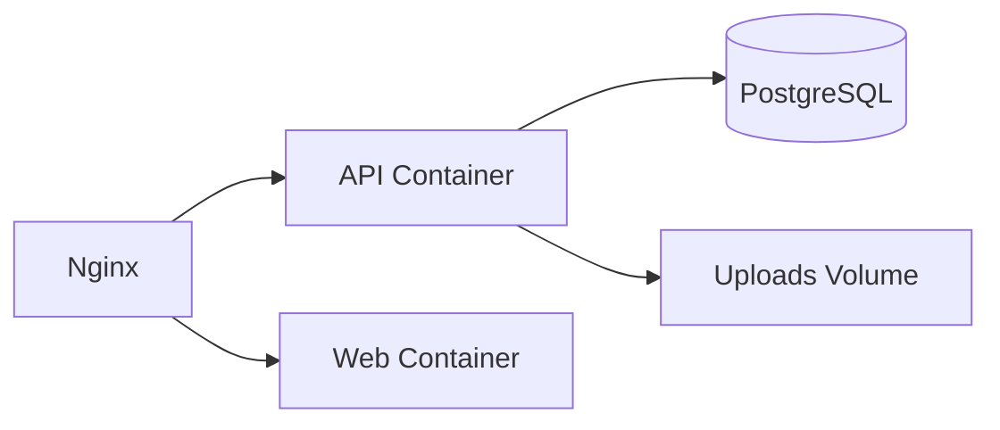

# CreatorOps: Self-Hosted Content and Community Operations

Social media management seems simple from the outside: find a few content ideas, prepare a draft, and publish. However, when teammates, community contributions, review cycles, and media files get involved, the process can quickly become scattered. Content ideas get lost in Notion, drafts in Google Docs, revisions in Slack, and visuals in Drive.

I experienced this problem firsthand while managing the social media side of the Shipin community. What we needed wasn't just a regular "social media scheduling tool," but a "content ops" platform where we could manage all these processes end-to-end.

CreatorOps was born out of this need. My goal was to bring the content calendar, revision workflows, data collection via public forms, dynamic form building, and team management together in the same system. Moreover, I designed all of this in a structure that teams who want to protect their data privacy can run on their own servers (self-hosted).

## The Problem I Tried to Solve

The main problem wasn't producing content, but managing the operation around the content. Let's say we want to collect a success story from the community. For this, a Typeform is opened, data is transferred to Airtable, taken from there and approved on Slack, and finally shared on social media using another tool.

With CreatorOps, I solved this clutter in three stages:

1. **Content Planning and Approval:** The entire calendar and revision process is unified in a single panel.
2. **Community Contributions:** Offers an infrastructure to collect applications/content from the outside with a dynamic form builder.
3. **Self-Hosted:** A structure where the data remains completely with you, featuring a single database and a single file upload layer.

## Technical Architecture and Technologies Used

While developing this project, I wanted to keep the architecture simple but scalable. The project was designed as a **Monorepo** (pnpm workspaces).

### Why Monorepo?

I divided the project into three as `apps/api`, `apps/web`, and `packages/db`. By making the Prisma schema and database types a separate package (`packages/db`), I used the same TypeScript types in both the frontend and backend projects. This way, when I change a field in the database, I can instantly get a type error on the frontend side. This structure provides tremendous convenience in terms of development speed and code consistency.

### Tech Stack

- **Frontend (Web):** React, Vite, TypeScript, React Router. I chose Vite to keep the panel as simple and fast as possible.
- **Backend (API):** Node.js, Express, TypeScript. A simple and flexible structure to manage domain rules and API endpoints.
- **Database and ORM:** PostgreSQL and Prisma.
- **Deployment:** Docker and Docker Compose.

## Core Features (What Did I Do?)

### Content Calendar and Approval Workflow

The calendar screen works as the team's daily operation center. What content is scheduled for which day, who it's assigned to, and its status (Draft, Pending Review, Approved) can be seen from a single screen. Content pending approval is clearly indicated in the list, and the revision cycle completely runs through this flow.

### Public Forms and Dynamic Form Builder

This is where CreatorOps steps out of being just an internal team tool. Managers can create dynamic forms with the question types they want (text, image upload, checkbox, etc.) via the **Form Builder**. These forms can be shared with a public link.

When someone from the community or the outside fills out this form, the data drops directly into the operational flow inside CreatorOps. Thus, there is no need to pay for external form tools or set up integrations.

### Media Management and Series

I built a built-in media management system into the project. Visuals or PDF files added to the content are written directly to the server's local filesystem. You can also categorize content with the logic of "Series" and assign specific managers to each series.

## Deployment (How is it Installed?)

Self-hosting the application is quite easy. Using Docker Compose, you can bring up the entire structure with a single command.

In the production environment, Nginx serves the React project (Web) and routes requests to `/api` and `/uploads` directly to the API container. During the installation phase, the API container automatically runs Prisma migrations while booting up. This way, you don't have to deal with an extra database setup step.

## Trade-offs (What Did I Sacrifice?)

As with every architectural decision, I made some trade-offs here too:

- **Local Upload Storage:** Media files are currently stored on the server's own disk. This makes installation incredibly simple for self-host scenarios, but when the data size grows significantly, an object storage integration like S3 will be required.
- **Stateless Auth:** I intentionally kept the authentication process simple with JWT. It works well enough at this stage, but more complex auth needs, such as token revocation, can be added in the future.

## Next Steps

I am currently working on a feature to automatically publish content prepared and approved within CreatorOps directly to social media platforms (LinkedIn, Instagram). Once this integration is finished, CreatorOps will turn into a fully-fledged, end-to-end publishing engine.

In summary, CreatorOps is not a project where I just piled on features; it became a product where I tried to solve the right problem with a simple, understandable, and sustainable architecture. If you want to manage your content operations from a single center, with your own data, you can examine the project and install it on your own server.
