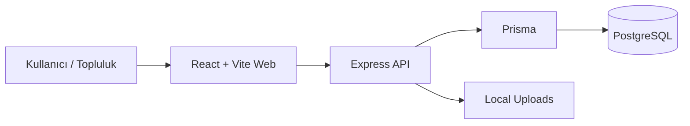
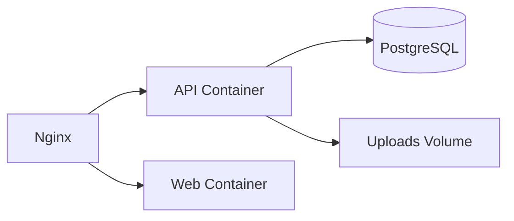

# CreatorOps: Self-Hosted İçerik ve Topluluk Operasyonları

Sosyal medya yönetimi dışarıdan bakıldığında basit duruyor: Birkaç içerik fikri bul, taslak hazırla ve yayınla. Ancak işin içine ekip arkadaşları, topluluk katkıları, onay (review) döngüleri ve medya dosyaları girince süreç hızla dağılabiliyor. İçerik fikirleri Notion'da, taslaklar Google Docs'ta, revizyonlar Slack'te, görseller ise Drive'da kayboluyor.

Bu problemi bizzat Shipin topluluğunda sosyal medya tarafını yönetirken yaşadım. İhtiyacımız olan şey sıradan bir "sosyal medya planlama aracı" değil, tüm bu süreçleri uçtan uca yönetebileceğimiz bir "içerik operasyon (content ops)" platformuydu.

CreatorOps bu ihtiyaçtan doğdu. Amacım, içerik takvimi, revizyon akışları, dışarıdan (public) formlar ile veri toplama, dinamik form oluşturma ve takım yönetimini aynı sistemde buluşturmaktı. Üstelik tüm bunları, veri gizliliğini korumak isteyen ekipler için kendi sunucularında (self-hosted) çalıştırabilecekleri bir yapıda kurguladım.

## Çözmeye Çalıştığım Problem

Asıl sorun içerik üretmek değil, içeriğin etrafındaki operasyonu yönetmekti. Diyelim ki topluluktan bir başarı hikayesi toplamak istiyoruz. Bunun için bir Typeform açılıyor, veriler Airtable'a aktarılıyor, oradan alınıp Slack'te onaylanıyor ve en son başka bir araçla sosyal medyada paylaşılıyor.

CreatorOps ile bu dağınıklığı üç aşamada çözdüm:

1. **İçerik Planlama ve Onay:** Tüm takvim ve revizyon süreci tek bir panelde birleşiyor.
2. **Topluluk Katkıları:** Dinamik form builder ile dışarıdan başvuru/içerik toplama altyapısı sunuyor.
3. **Self-Hosted:** Verinin tamamen sizde kaldığı, tek veritabanı ve tek dosya yükleme (upload) katmanı.

## Teknik Mimari ve Kullanılan Teknolojiler

Bu projeyi geliştirirken mimariyi sade ama ölçeklenebilir tutmak istedim. Proje bir **Monorepo** (pnpm workspaces) olarak tasarlandı.

### Neden Monorepo?

Projeyi `apps/api`, `apps/web` ve `packages/db` olarak üçe böldüm. Prisma şemasını ve veritabanı tiplerini ayrı bir paket (`packages/db`) yaparak hem frontend hem de backend projelerinde aynı TypeScript tiplerini kullandım. Bu sayede veritabanında bir alanı değiştirdiğimde, frontend tarafında anında tip hatası (type error) alabiliyorum. Bu yapı, geliştirme hızı ve kod tutarlılığı açısından müthiş bir kolaylık sağlıyor.

### Teknoloji Yığını (Tech Stack)

- **Frontend (Web):** React, Vite, TypeScript, React Router. Paneli olabildiğince sade ve hızlı tutmak için Vite tercih ettim.
- **Backend (API):** Node.js, Express, TypeScript. Domain kurallarını ve API uç noktalarını (endpoints) yönetmek için basit ve esnek bir yapı.
- **Veritabanı ve ORM:** PostgreSQL ve Prisma.
- **Dağıtım (Deployment):** Docker ve Docker Compose.

## Temel Özellikler (Neler Yaptım?)

### İçerik Takvimi ve Onay Akışı

Takvim ekranı, ekibin günlük operasyon merkezi olarak çalışıyor. Hangi gün hangi içerik var, kime atanmış ve durumu ne (Draft, Pending Review, Approved) tek bir ekrandan görünüyor. Onay bekleyen içerikler listede açıkça belirtiliyor ve revizyon döngüsü tamamen bu akış üzerinden işliyor.

### Public Forms ve Dinamik Form Oluşturucu

CreatorOps'u sadece bir iç ekip aracı olmaktan çıkaran yer burası. Yöneticiler, **Form Builder** üzerinden istedikleri soru tipleriyle (metin, görsel yükleme, onay kutusu vb.) dinamik formlar oluşturabiliyor. Bu formlar herkese açık (public) bir link ile paylaşılabiliyor.

Topluluktan veya dışarıdan biri bu formu doldurduğunda, veriler doğrudan CreatorOps'un içindeki operasyon akışına düşüyor. Böylece harici form araçlarına para ödemek veya entegrasyon kurgulamak gerekmiyor.

### Medya Yönetimi ve Seriler

Projeye yerleşik bir medya yönetim sistemi kurdum. İçeriklere eklenen görseller veya PDF dosyaları doğrudan sunucunun yerel diskine (local filesystem) yazılıyor. Ayrıca "Seriler" (Series) mantığıyla içerikleri kategorize edip, her seriye özel yöneticiler atayabiliyorsunuz.

## Deployment (Nasıl Kuruluyor?)

Uygulamayı self-host etmek oldukça kolay. Docker Compose kullanarak tüm yapıyı tek bir komutla ayağa kaldırabiliyorsunuz.

Production ortamında Nginx, React projesini (Web) sunuyor ve `/api` ile `/uploads` isteklerini doğrudan API container'ına yönlendiriyor. Kurulum aşamasında API container'ı ayağa kalkarken otomatik olarak Prisma migration'larını çalıştırıyor. Böylece ekstra bir veritabanı kurulum adımıyla uğraşmanıza gerek kalmıyor.

## Trade-off'lar (Nelerden Feragat Ettim?)

Her mimari kararda olduğu gibi burada da bazı ödünler verdim:

- **Local Upload Storage:** Medya dosyaları şu an sunucunun kendi diskinde tutuluyor. Self-host senaryoları için kurulumu inanılmaz basitleştiriyor, ancak veri boyutu çok büyüdüğünde S3 gibi bir object storage entegrasyonu gerekecek.
- **Stateless Auth:** Kimlik doğrulama sürecini JWT ile bilerek basit tuttum. Şu aşamada gayet yeterli çalışıyor, fakat ileride yetkilendirme iptalleri (token revocation) gibi daha kompleks auth ihtiyaçları eklenebilir.

## Sonraki Adımlar

Şu anda CreatorOps içerisinde hazırlanan ve onaylanan içerikleri doğrudan sosyal medya platformlarına (LinkedIn, Instagram) otomatik publish etme özelliği üzerinde çalışıyorum. Bu entegrasyon bittiğinde, CreatorOps baştan uca tam teşekküllü bir yayın motoruna dönüşecek.

Özetle CreatorOps benim için öylesine özellik yığdığım bir proje değil; doğru problemi basit, anlaşılır ve sürdürülebilir bir mimariyle çözmeye çalıştığım bir ürün oldu. Eğer siz de içerik operasyonlarınızı tek bir merkezden, kendi verinizle yönetmek isterseniz projeyi inceleyebilir ve kendi sunucunuza kurabilirsiniz.
